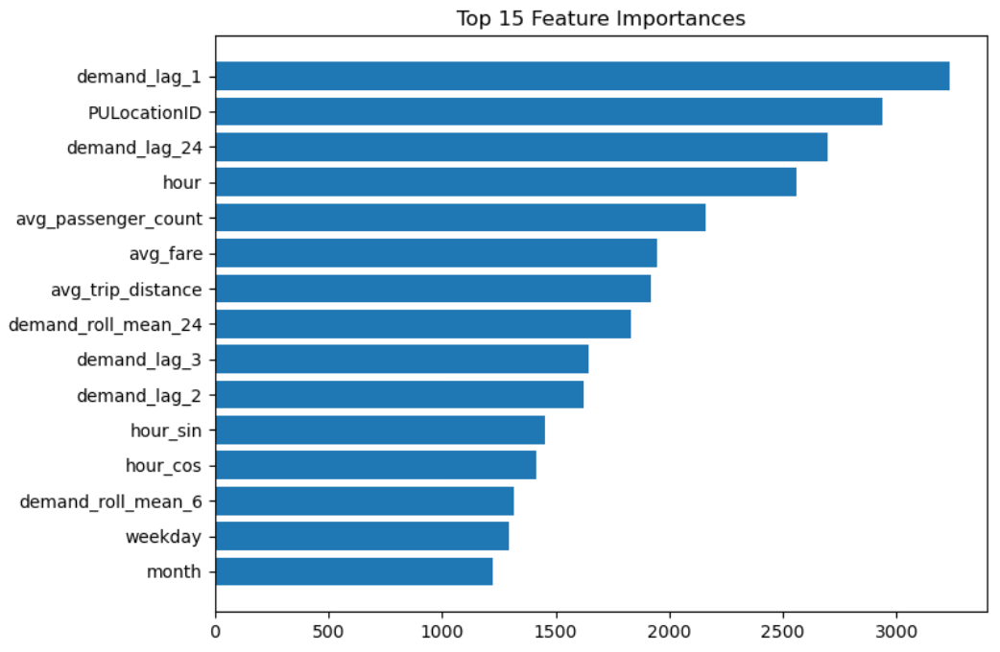
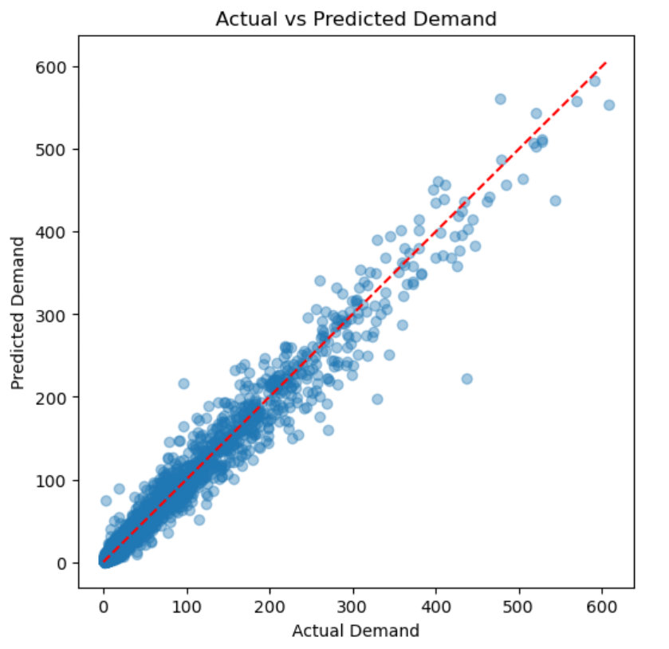
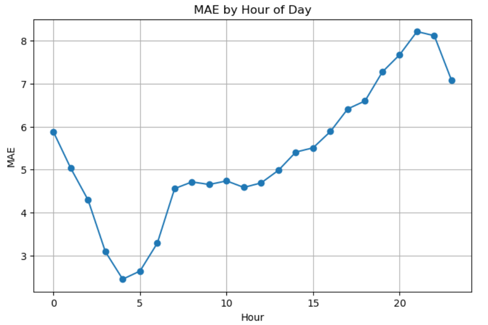
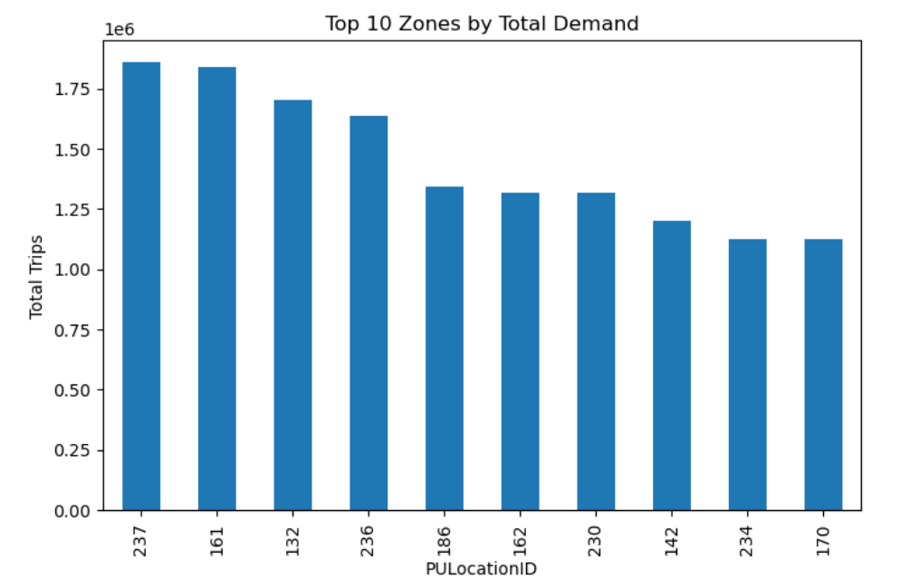

# 🚕 NYC Taxi Demand Forecasting & Analytics Platform

## 📌 Project Overview
This project builds an end-to-end demand forecasting and analytics platform for NYC Yellow Taxi trips.  
The goal is to predict hourly taxi demand at the zone level and translate those forecasts into actionable business insights for operational planning.

The project covers the full data science lifecycle:
- Large-scale data ingestion
- Data cleaning and feature engineering
- Time-series–aware machine learning
- Model evaluation and error analysis
- Business insights and dashboard-ready outputs

---

## 🎯 Problem Statement
Taxi demand in New York City varies significantly by:
- Time of day
- Day of week
- Geographic zone

Accurately forecasting demand at a **Zone × Hour** level enables:
- Better fleet allocation
- Reduced passenger wait times
- Increased driver utilization
- Data-driven operational decisions

---

## 🗂️ Project Structure
NYC Taxi Demand Forecasting & Analytics Platform/
│
├── notebooks/
│ ├── 01_Data_Loading_and_Merging.ipynb
│ ├── 02_Data_Cleaning_and_EDA.ipynb
│ ├── 03_Feature_Engineering.ipynb
│ ├── 04_Modeling_Forecasting.ipynb
│ ├── 05_Model_Evaluation_and_Error_Analysis.ipynb
│ └── 06_Business_Insights_and_Dashboard_Prep.ipynb
│
├── data/
│ ├── raw/
│ └── cleaned/
│
├── outputs/
│ ├── models/
│ └── dashboard/
│
├── README.md

---

## 📊 Data
- **Source:** NYC Yellow Taxi Trip Records  
- **Format:** Parquet  
- **Scale:** ~44 million raw trip records  

**Final Modeling Dataset:**  
~1.27 million rows (Hour × Zone aggregation)

---

## 🧹 Data Processing

### Notebook 1 – Data Loading & Merging
- Efficient loading of large Parquet files using pyarrow
- Merging multiple files into a single dataset
- Memory usage monitoring

### Notebook 2 – Data Cleaning & EDA
- Removal of invalid and inconsistent records
- Handling missing values
- Creation of basic time-based features
- Exploratory data analysis

---

## 🧠 Feature Engineering

### Notebook 3 – Feature Engineering
The modeling dataset is aggregated to **Hour × Zone** granularity.

**Key Features:**
- Time-based features (hour, weekday, month)
- Cyclical encoding (sin/cos for hour and weekday)
- Lag features (1, 2, 3, 24 hours)
- Rolling statistics (3, 6, 24 hours)
- Aggregated trip characteristics:
  - Average fare
  - Average trip distance
  - Average passenger count
- Holiday indicator (NY / US)

**Target Variable:**  
`demand` = number of trips per zone per hour

---

## 🤖 Modeling

### Notebook 4 – Modeling & Forecasting
- **Model:** LightGBM Regressor
- **Validation Strategy:** Time-based train/test split (80% / 20%)
- **Baseline:** Naive lag-1 prediction

**Performance:**

| Metric | Baseline | LightGBM |
|------|----------|----------|
| MAE | 8.80 | 5.34 |
| RMSE | 21.89 | 12.51 |
| MAE Improvement | – | ~39% |

The model significantly outperforms a strong lag-based baseline.

---

## 🔍 Model Evaluation & Error Analysis

### Notebook 5 – Evaluation
Performance analyzed by:
- Zone
- Hour of day
- Weekday vs Weekend
- Residual analysis over time
- Actual vs Predicted visualizations

**Key Findings:**
- Strong overall stability with no temporal drift
- Higher errors during evening rush hours due to demand volatility
- A small subset of zones (e.g., major hubs) are inherently harder to predict

---

## 📊 Key Visual Insights

### Feature Importance


### Model Predictions vs Actual Demand


### Forecasting Error by Hour of Day


### Top 10 Zones by Total Demand


---

## 📈 Business Insights

### Notebook 6 – Business Insights & Dashboard Prep

**Key Insights:**
- Taxi demand is highly concentrated in a small number of zones
- Demand follows a strong daily cycle with clear evening peaks
- Operational hotspots are defined by Zone × Hour combinations
- Weekend demand is slightly lower but more variable

**Business Recommendations:**
- Prioritize high-demand zones for fleet allocation
- Increase supply during peak commuting hours
- Apply adaptive strategies for volatile zones (e.g., airports)
- Use forecasts for proactive vehicle positioning

Dashboard-ready outputs are saved as CSV files for easy integration.

---

## 🛠️ Tech Stack
- Python
- pandas / numpy
- pyarrow
- LightGBM
- scikit-learn
- matplotlib
- holidays

---

## 🚀 How to Run
1. Clone the repository
2. Create or activate a Conda environment
3. Install dependencies:
   ```bash
   conda install -c conda-forge pandas numpy pyarrow lightgbm holidays matplotlib scikit-learn
4. Run notebooks in order from 01_ to 06_

---

## 🏁 Conclusion

This project demonstrates how large-scale taxi data can be transformed into:
- Accurate demand forecasts
- Interpretable machine learning models
- Actionable operational insights

It showcases strong skills in:
- Data engineering
- Time series forecasting
- Feature engineering
- Model evaluation
- Business-oriented analytics

---

## ✨ Author

**Mohammed Almajhad**  
